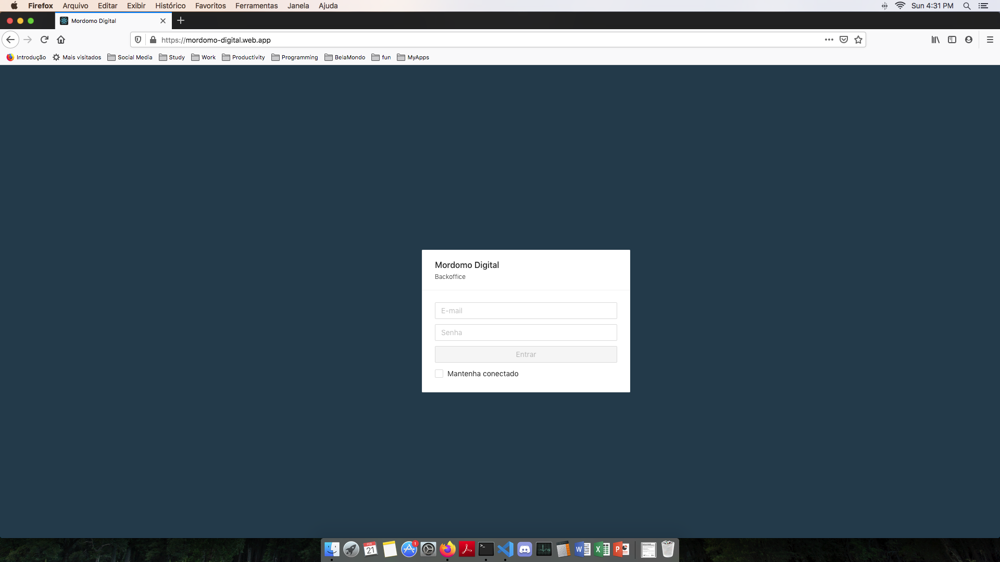
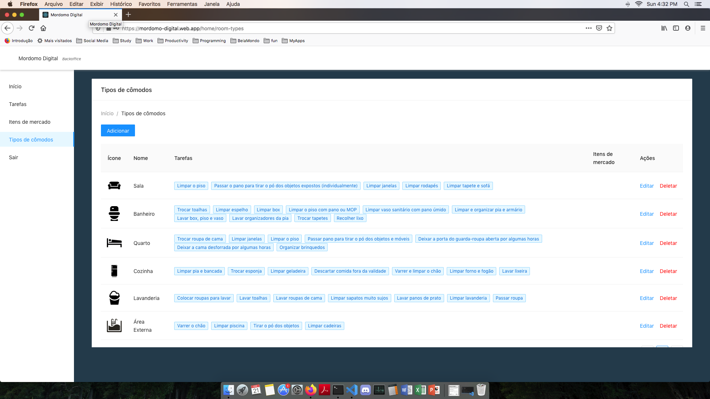
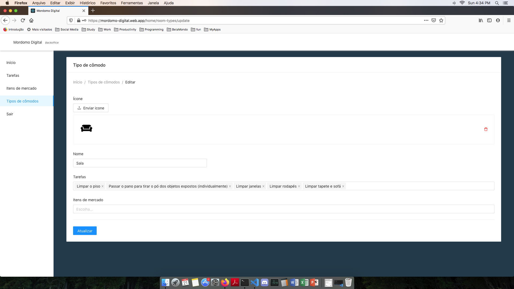

# Mordomo Digital Backoffice

Backoffice of the Mordomo Digital app developed with ReactJs.

- [Screens](#screens)
  - [Login](#login)
  - [List](#list)
  - [Form](#form)
- [Running the project](#running-the-project)
  - [Prerequisites](#prerequisites)
  - [Instalation](#instalation)
  - [Start](#start)
- [Project structure](#project-structure)
  - [/Components](#Components)
  - [/node_modules](#node_modules)
- [Authors](#authors)

## Screens

### Login



### List



### Form



## Running the project

Follow the instructions below to copy the project and run locally.

### Prerequisites

As prerequisites to run the project is needed to have Node.js and the package manager NPM installed in you machine.

The backend server needs to be runing too. The backend repo can be access [here](https://github.com/alexisbarros/mordomo-digital-api.git).

### Instalation

Clone the project with the command:

```sh
$ git clone https://github.com/alexisbarros/mordomo-digital-backoffice.git
```

Go to the created folder:

```sh
$ cd mordomo-digital-backoffice
```

Install all dependencies:

```sh
$ npm install
```

### Start

With backend server runing, start the project using:

```sh
$ npm start
```

## Project structure

The project is structured as follows:

```
mordomo-digital-backoffice/
  public/
  node_modules/
  src/
    Components/
      Home/
      Login/
      MarketItens/
      RoomTasks/
      RoomTypes/
    env.json
    index.js
    index.css
  package.json
  README.md
```

Below is a breakdown of some project directories.

### /src/Components

Contains all components of the project.

### /node_modules

Contains all the modules installed by NPM.

## Authors

Alexis Barros - [github](https://github.com/alexisbarros)